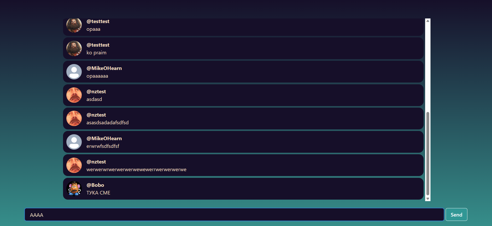

    <h1>ChatPat</h1>
    
    <a href="https://youtu.be/ZPlYe-DWpns">Demo</a>
    
    <ul style="text-align: left; list-style: none;">
        <h3>Using:</h3>
        <li>Node.js</li>
        <li>Express</li>
        <li>React + Chakra UI</li>
        <li>MongoDB</li>
    </ul>

